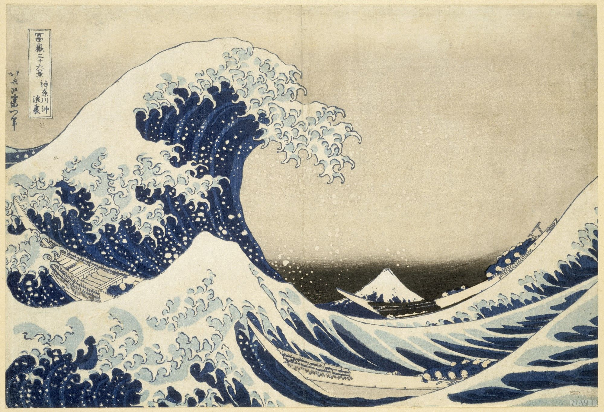

# TensorFlow-Image-Style-Transfer
Image Style Transfer Using Convolutional Neural Networks

## paper  
    * http://openaccess.thecvf.com/content_cvpr_2016/papers/Gatys_Image_Style_Transfer_CVPR_2016_paper.pdf  
    * https://arxiv.org/pdf/1508.06576.pdf

## pretrained VGG19 network 사용.
    * http://www.vlfeat.org/matconvnet/pretrained/  에서 imagenet-vgg-verydeep-19 파일다운로드.

## content_cost
    * tf.reduce_sum(tf.square(noise_conv4_2 - content_conv4_2)))/2
    
## style_cost
    * conv1_1, conv2_1, conv3_1, conv4_1, conv5_1 전부 사용
    * tf.reduce_sum(tf.square(gram_matrix(noise_conv1_1) - gram_matrix(style_conv1_1))) / (4*N*N*M*M) * 0.2(=w)
    * 위 식을 conv1_1, conv2_1, ..., conv5_1에 관해서 계산 후 tf.reduce_sum으로 더함.
    * N: # filter, M: H(height)*W(width)

## gram_matrix
    * ex) noise_conv1_1 (shape: 1, H, W, N)
    * flatten = tf.transpose(noise_conv1_1, [3, 1, 2, 0]) (shape: N, H, W, 1) 이 부분이 중요함. 단순히 reshape(M, N)하면 안됨.
    * flatten = tf.reshape(flatten, (N, M)
    * gram = tf.matmul(flatten, tf.transpose(flatten))
    
## total_cost
    * alpha * content_cost + beta * style_cost

# result
|Style|Content|Result|
|:-------------------------:|:-------------------------:|:-------------------------:|
|| /style/udnie.jpg||
|  |  ||
|  |  ||
