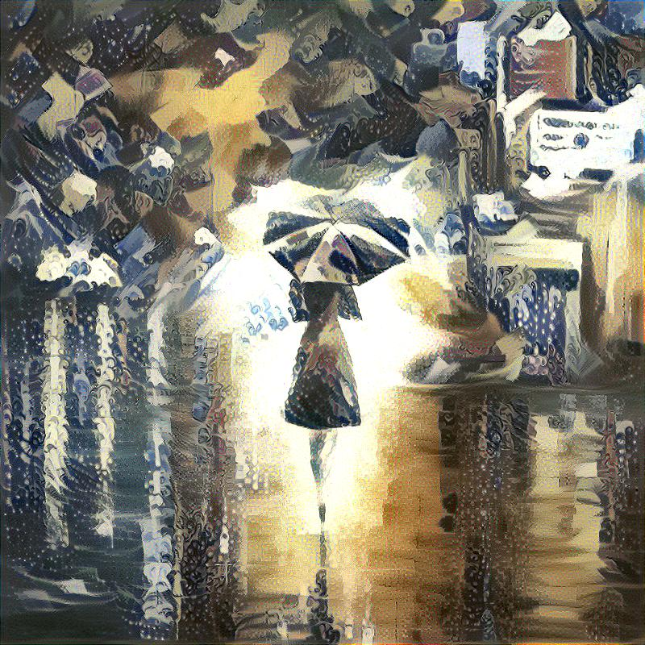

# TensorFlow-Image-Style-Transfer
Image Style Transfer Using Convolutional Neural Networks

TensorFlow version == 1.4

## paper  
    * http://openaccess.thecvf.com/content_cvpr_2016/papers/Gatys_Image_Style_Transfer_CVPR_2016_paper.pdf  
    * https://arxiv.org/pdf/1508.06576.pdf
        * 미리 학습된 VGG19 모델에 tf.variable의 noise 이미지를 넣고, 원하는 content, style 이미지를 반영하도록 학습.
        * 다른 Variable은 학습 되지 않도록 고정. (올려둔 코드에서는 noise만 variable이므로 따로 고정 하지 않음)

## pretrained VGG19 network
    * http://www.vlfeat.org/matconvnet/pretrained/ 에서 imagenet-vgg-verydeep-19 다운로드.

## content_cost
    * conv4_2 사용
    * tf.reduce_sum(tf.square(noise_conv4_2 - content_conv4_2)))/2
    
## style_cost
    * conv1_1, conv2_1, conv3_1, conv4_1, conv5_1 전부 사용
    * tf.reduce_sum(tf.square(gram_matrix(noise_conv1_1) - gram_matrix(style_conv1_1))) / (4*N*N*M*M) * 0.2(== w)
        * N: # filter, M: H(height)*W(width)
    * 위 식을 conv1_1, conv2_1, ..., conv5_1에 관해서 계산 후 tf.reduce_sum으로 더함.

## gram_matrix
    * ex) noise_conv1_1 (shape: 1, H, W, N)
    * flatten = tf.transpose(noise_conv1_1, [3, 1, 2, 0]) (shape: N, H, W, 1)
        * 이 부분이 중요함. tf.transpose 없이 reshape(M, N)하면 안됨. 그냥 하면 filter(N) 특성이 깨짐.
    * flatten = tf.reshape(flatten, (N, M)
    * gram = tf.matmul(flatten, tf.transpose(flatten))
    
## total_cost
    * alpha * content_cost + beta * style_cost

## result
|Content|Style|Result|
|:-------------------------:|:-------------------------:|:-------------------------:|
| /style/The_Great_Wave_off_Kanagawa.jpg| /style/udnie.jpg| /store/kanagawa_udnie.jpg |
| /style/rain_princess.jpg | /style/The_Great_Wave_off_Kanagawa.jpg| /store/rain_kanagawa.jpg |
| /style/rain_princess.jpg | /style/udnie.jpg| /store/rain_udnie.jpg|
| /style/starry-night.jpg | /style/rain_princess.jpg| /store/starry_rain.jpg|

## style reconstructions (https://arxiv.org/pdf/1508.06576.pdf 3page, starry-night)
    * style_cost만 minimize 하도록 학습. (원본 이미지(style image)가 복원되지 않고 texture만 복원됨)
|conv1_1|conv1_1~conv2_1|conv1_1~conv3_1|
|:-------------------------:|:-------------------------:|:-------------------------:|
| /style_reconstructions/conv1.jpg| style_reconstructions/conv1~2.jpg| /style_reconstructions/conv1~3.jpg |

|conv1_1~conv4_1|conv1_1~conv5_1|
|:-------------------------:|:-------------------------:|
| /style_reconstructions/conv1~4.jpg| style_reconstructions/conv1~5.jpg|

## content reconstructions 
    * content_cost만 minimize 하도록 학습 하는 경우에는 원본 이미지(content image)가 복원됨
    * 복원된 이미지는 원본과 동일하므로, 이미지 삽입 생략
